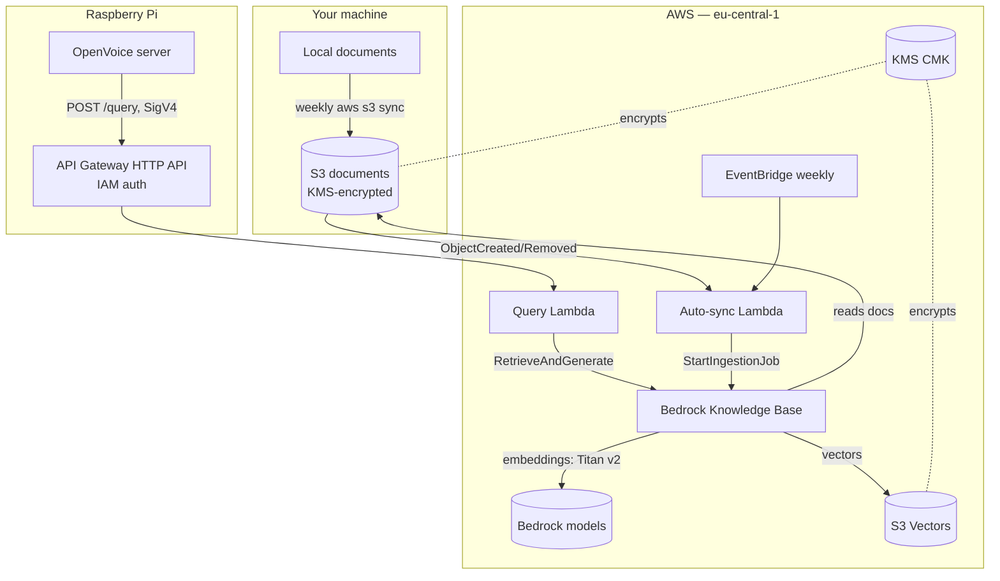

# familIA

A private, low-cost **RAG assistant over your own family documents**, built
entirely with Terraform on AWS.

Documents live encrypted in S3 (synced from your local disk). Amazon Bedrock
Knowledge Bases index them into a cheap **S3 Vectors** store, and a small Lambda
answers questions grounded in those documents via `RetrieveAndGenerate`. A
Raspberry Pi running an OpenVoice server calls the API — authenticated with
IAM/SigV4, so there are no shared secrets.

> **Privacy by design:** no personal data is ever committed to this repo. The
> family context comes exclusively from the documents you index (RAG), never
> from prompts or code. See [Privacy & secrets](#privacy--secrets).

---

## Architecture



**Why these choices**

| Concern | Choice | Rationale |
|---|---|---|
| Vector store | **S3 Vectors** | No OpenSearch Serverless OCU charges; pay-per-use. Cheapest managed option. |
| Embeddings | **Titan Text v2 @ 1024 dims** | Strong retrieval quality; dims are immutable so we pick well once. |
| Chunking | **Hierarchical** | Retrieves precise child chunks, feeds larger parent chunks for context. |
| Parsing | **Bedrock FM parsing** | Understands tables, layout and scanned PDFs — the biggest lever on quality. |
| Generation | **Configurable (Haiku default)** | Query volume is tiny at home, so cost is negligible; kept swappable. |
| Auth | **IAM / SigV4** | Strong auth, zero extra cost, no secrets in the repo. |
| Encryption | **Customer-managed KMS key** | Auditable, revocable; encrypts docs, vectors and logs. |

---

## Repository layout

```
terraform/            # all infrastructure as code
  versions.tf         # provider + S3 remote-state backend (partial config)
  variables.tf        # all knobs; generic defaults, no PII
  kms.tf              # customer-managed encryption key
  s3_documents.tf     # documents bucket (KMS, versioned, public access blocked)
  s3_vectors.tf       # S3 Vectors bucket + index (immutable dims/metric)
  iam_bedrock_kb.tf   # least-privilege role for the Knowledge Base
  knowledge_base.tf   # Bedrock KB + data source (hierarchical + advanced parsing)
  lambda_query.tf     # query Lambda + role + logs
  api_gateway.tf      # HTTP API (IAM auth) + Raspberry Pi IAM user
  lambda_auto_sync.tf # reindex Lambda (S3 event + weekly schedule)
  outputs.tf
  terraform.tfvars.example
lambda/
  query/handler.py       # RetrieveAndGenerate; generic PII-free prompt
  auto_sync/handler.py   # StartIngestionJob with overlap guard
scripts/
  bootstrap_backend.sh    # one-time: create the state bucket
  create_pi_credentials.sh# create the Pi IAM access key (secret stays local)
  sync_docs.sh            # aws s3 sync local -> bucket (use in cron)
  ask.py                  # SigV4 reference client for the Pi
  destroy_poc.sh          # delete the old hand-built PoC resources
```

---

## Prerequisites

- Terraform >= 1.5, AWS provider >= 6.0 (installed automatically).
- AWS credentials for the target account (`aws sso login` or a profile).
- Bedrock **model access enabled** in `eu-central-1` for the embedding,
  parsing and generation models (Bedrock console → Model access).

---

## Deploy

```bash
# 1. One-time: create the remote-state bucket (pick a globally-unique name)
AWS_PROFILE=<profile> ./scripts/bootstrap_backend.sh my-familia-tfstate-<accountid>

# 2. Configure your variables
cd terraform
cp terraform.tfvars.example terraform.tfvars   # edit if desired (defaults are fine)

# 3. Initialise with the remote backend
terraform init \
  -backend-config="bucket=my-familia-tfstate-<accountid>" \
  -backend-config="key=familia/terraform.tfstate" \
  -backend-config="region=eu-central-1" \
  -backend-config="use_lockfile=true"

# 4. Phase 1 — deploy base infra (empty bucket + vector index, no KB yet)
#    terraform.tfvars keeps enable_knowledge_base = false
terraform apply
```

The deploy is intentionally **two-phase** so the vector store and Knowledge
Base start empty and are only built once your documents exist:

- **Phase 1 (`enable_knowledge_base = false`, the default):** creates the empty
  documents bucket, the S3 Vectors store, IAM, the API and the query Lambda.
- Now **load your documents** from your data machine (see below).
- **Phase 2 (`enable_knowledge_base = true`):** creates the Knowledge Base, its
  S3 data source and the auto-sync Lambda, then indexes what's in the bucket.

```bash
# After documents are uploaded, flip the switch and apply again:
terraform apply -var="enable_knowledge_base=true"
# (or set enable_knowledge_base = true in terraform.tfvars)
```

Prefer local state? Comment out the `backend "s3" {}` block in `versions.tf` and
run `terraform init` with no backend config. Never commit the `.tfstate` file.

After each apply, note the outputs (`query_api_url`, `docs_bucket`,
`knowledge_base_id`).

---

## Indexing strategy (precision + provenance)

Retrieval quality is driven by three things, all wired in:

1. **Hierarchical chunking + foundation-model parsing** — precise child chunks
   with parent-chunk context, and a model that understands tables, layout and
   scanned PDFs.
2. **Folder-derived metadata.** Your documents are organised as
   `topic/owner/[subfolders...]/file.ext`. `scripts/generate_metadata.py` walks
   the tree and writes a `<file>.metadata.json` sidecar next to each document:

   ```jsonc
   // salud/alba/informes/analisis.pdf.metadata.json
   {
     "metadataAttributes": {
       "topic": "salud", "owner": "alba", "subpath": "informes",
       "doc_type": "pdf", "file_name": "analisis.pdf",
       "source_path": "salud/alba/informes/analisis.pdf"
     }
   }
   ```

   Bedrock indexes these as **filterable** attributes in S3 Vectors, so a query
   can be narrowed to a person or subject — a big precision win. (The raw chunk
   text is stored non-filterable to stay within the S3 Vectors metadata size
   budget.) These keys are immutable once the index exists, so they're pinned.
3. **Source always returned.** Every answer includes a `sources` array with the
   S3 URI plus `topic`/`owner`/`source_path` for each retrieved chunk, so you
   always know which file the information came from.

## Load your documents

The document machine does not need the Terraform repo — just Python 3, AWS CLI,
and three files from `scripts/`: `sync_docs.sh`, `generate_metadata.py`, and
your own `familia.config.json`. Copy them over and run from there.

**Credentials** are resolved via the standard AWS chain, so use whichever you
already have — no `AWS_PROFILE` required:

```bash
# Option 1: exported environment variables (temporary or long-lived)
export AWS_ACCESS_KEY_ID=...        # + AWS_SECRET_ACCESS_KEY
export AWS_SECRET_ACCESS_KEY=...    # + AWS_SESSION_TOKEN if temporary
export AWS_REGION=eu-central-1

# Option 2: a named profile
export AWS_PROFILE=<name>

# Option 3: SSO login (aws sso login --profile <name>)
```

`sync_docs.sh` runs a credential preflight (`aws sts get-caller-identity`) and
prints the resolved identity, failing fast with guidance if none is found.

**One-time setup on the document machine:**

```bash
# Map your folder aliases to display names (this file is gitignored — it holds
# real names and must never be committed).
cp scripts/familia.config.example.json scripts/familia.config.json
$EDITOR scripts/familia.config.json
```

The `owners` map tells the metadata generator which folder names are people, so
it can **auto-detect** whether your tree is `topic/owner/...` or `owner/topic/...`
per document (matching is case- and accent-insensitive). Set `options.layout`
to `"topic_owner"` or `"owner_topic"` to force an order instead of `"auto"`.

**Every sync (manual or weekly cron):**

```bash
# Args: <bucket> <prefix> <root> [<root> ...]   (prefix may be "")
# Regenerates metadata from the CURRENT folder structure (so reorganising
# folders updates metadata), then mirrors documents + sidecars to S3.
AWS_PROFILE=<profile> ./scripts/sync_docs.sh \
  "<docs-bucket-name>" documents "$HOME/Documents/Family"

# Multiple roots: each is mirrored into its OWN subprefix (named after the
# root's folder) so they never delete each other under --delete:
AWS_PROFILE=<profile> ./scripts/sync_docs.sh \
  "<docs-bucket-name>" documents "$HOME/Documents/Family" "$HOME/Scans"

# Override a root's subprefix with "path=subname":
AWS_PROFILE=<profile> ./scripts/sync_docs.sh \
  "<docs-bucket-name>" documents "/mnt/nas/health=salud" "/mnt/nas/school=colegio"

# Preview metadata changes for a root without writing or uploading anything:
python3 scripts/generate_metadata.py "$HOME/Documents/Family" --dry-run --prune
```

Each root is synced recursively (all subfolders). `topic`/`owner` metadata is
derived from the folders *inside* each root, so the subprefix does not affect
your `topic/owner` scheme.

Uploading objects triggers the auto-sync Lambda, which starts a Knowledge Base
ingestion job. A weekly schedule (Sun 03:00 Europe/Madrid) is a safety net. You
can also trigger a first full ingestion from the Bedrock console or by invoking
the `familia-auto-sync` Lambda once.

---

## Use it from the Raspberry Pi

```bash
# 1. Create the Pi's IAM access key (run once, on your machine)
AWS_PROFILE=<profile> ./scripts/create_pi_credentials.sh \
  "$(cd terraform && terraform output -raw pi_client_user)" pi-credentials.env
# pi-credentials.env is gitignored — copy it to the Pi over scp, never commit it.

# 2. On the Pi
pip install botocore requests
source pi-credentials.env
export FAMILIA_API_URL="$(terraform output -raw query_api_url)"   # or paste it

python3 scripts/ask.py "your question here"
# Narrow retrieval by folder metadata for higher precision:
python3 scripts/ask.py --owner alba --topic salud "when was the last check-up?"
```

The OpenVoice server can import `ask()` from `scripts/ask.py` and pass the
transcribed question straight through, then speak `result["answer"]`.

Request/response contract:

```jsonc
// POST /query   (SigV4-signed)
{
  "question": "…",
  "sessionId": "optional-for-follow-ups",
  "owner": "optional folder-owner filter",
  "topic": "optional folder-topic filter",
  "filter": { /* optional raw Bedrock retrieval filter, overrides owner/topic */ }
}
// 200 OK
{
  "answer": "…",
  "sessionId": "…",
  "sources": [
    { "uri": "s3://…/salud/alba/informes/analisis.pdf",
      "topic": "salud", "owner": "alba",
      "source_path": "salud/alba/informes/analisis.pdf" }
  ]
}
```

---

## Cost notes

Dominant cost is **one-time ingestion** (advanced parsing + embeddings), which
scales with how much you index — hence "index once, well". Ongoing cost for a
home workload is a few dollars/month: the KMS key (~1 USD/month), S3 storage,
S3 Vectors storage/queries, and per-question Bedrock generation (cents). There
are no always-on servers. To cut ingestion cost, set
`enable_advanced_parsing = false` or a smaller `embedding_dimensions`.

---

## Privacy & secrets

This repo is safe to publish publicly:

- **No PII in code or prompts.** The generation prompt is generic; all family
  facts live only in your S3 documents and the derived vectors.
- **No secrets committed.** `.gitignore` blocks `*.tfstate`, `*.tfvars`,
  `.env`, keys, and document file types. Only `*.tfvars.example` is tracked.
- **The Pi's secret key is never in Terraform state** — Terraform creates only
  the IAM user; the access key is generated out-of-band by a script and stored
  locally.
- **Everything sensitive is encrypted** with a customer-managed KMS key, and
  the documents bucket blocks all public access and denies non-TLS requests.

Before committing, run the check in [Validate](#validate).

---

## Retiring the old PoC

The original proof-of-concept was built by hand (no IaC). Once this stack is
deployed and verified, remove the old resources:

```bash
AWS_PROFILE=<profile> ./scripts/destroy_poc.sh              # keeps the old docs bucket
AWS_PROFILE=<profile> ./scripts/destroy_poc.sh --with-bucket # also deletes it (your files!)
```

The script lists everything and requires typing `DELETE` to proceed.

---

## Validate

```bash
cd terraform
terraform fmt -recursive
terraform validate

# Secret/PII scan before committing (should print nothing):
git grep -nEi "AKIA[0-9A-Z]{16}|-----BEGIN|password|secret_key" -- . ':!*.example' || true
```

---

## Extending to a Bedrock Agent

The current design uses a single Lambda calling `RetrieveAndGenerate` (simplest,
cheapest). If you later need multi-step reasoning or tool/actions, you can add a
Bedrock Agent that references the same Knowledge Base without changing the
storage or ingestion layers.

---

## License

GPL-3.0 — see [LICENSE](LICENSE).
